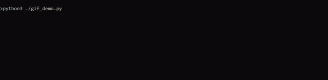

# Rubiks Cube Solver - ML Final Project 2025

My Machine Learning 11.42 Final Project, an AI to solve 3x3 Rubik's Cubes using Pytorch

See [the write up](./ML_Final_Project.ipynb) for the full description of the project

